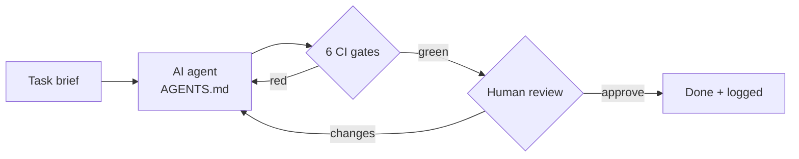

# AIxTech demo: an AI-agent harness on a Singapore weather starter

> **What this is:** a small, public reference repo that shows *how* a team can let
> AI coding agents write code **safely**: rules for the agent, automatic quality
> gates, a human sign-off and a written trail of what the AI did.
> The weather code is deliberately small. The process around it is what the repo demonstrates.

[](https://github.com/zeekiankok92/aixtech-agent-harness-demo/actions/workflows/ci.yml)
[](scripts/coverage_badge.py)
 

**Start here:** [How this repo was built with AI agents](docs/how-this-repo-was-built.md) ·
[Sample output](docs/sample-output.md) · [Engagement offer](docs/engagement-offer.md)

## Who it is for
Singapore SMEs and small tech teams who want to use AI coding assistants
(Claude Code, Cursor, Copilot and others) but need answers to:

- *How do we stop the AI shipping broken or insecure code?* Six automatic CI gates.
- *How do we keep customer data out of AI tools (PDPA)?* Agent rules, synthetic fixtures and a CI tripwire.
- *Who is accountable?* A named human reviewer signs off every change. That review is part of the Definition of Done.
- *Can we prove what the AI did?* Commit trailers, an AI-disclosure log and a review log.
- *Is it actually faster?* A before/after cycle-time **template**, so you can measure that on your own work.

## What it demonstrates

| Harness piece | File(s) |
|---|---|
| Agent rules (one source of truth) | [`AGENTS.md`](AGENTS.md), [`CLAUDE.md`](CLAUDE.md) |
| Task briefs with testable acceptance criteria | [`harness/templates/`](harness/templates), [`tasks/`](tasks), [`.github/ISSUE_TEMPLATE/`](.github/ISSUE_TEMPLATE) |
| Human review checklist | [`harness/review-checklist.md`](harness/review-checklist.md) |
| **Definition of Done = CI green + human review** | [`harness/definition-of-done.md`](harness/definition-of-done.md) |
| CI gates (GitHub Actions) | [`.github/workflows/ci.yml`](.github/workflows/ci.yml) |
| Same gates, run locally | [`scripts/ci_local.sh`](scripts/ci_local.sh) |
| PR template with AI-disclosure section | [`.github/pull_request_template.md`](.github/pull_request_template.md) |
| AI-disclosure trail | [`docs/ai-disclosure-log.md`](docs/ai-disclosure-log.md) plus `AI-Assisted:` commit trailers |
| Review log | [`docs/review-log.md`](docs/review-log.md) |
| Cycle-time measurement (template) | [`docs/cycle-time-template.md`](docs/cycle-time-template.md) |
| Cycle-time evidence from this repo's git history (real timestamps) | [`docs/cycle-time-evidence.md`](docs/cycle-time-evidence.md), generated by `scripts/cycle_time_from_git.py` |
| Build walkthrough: brief, agent, gates, human | [`docs/how-this-repo-was-built.md`](docs/how-this-repo-was-built.md) |
| Ownership and supply chain | [`.github/CODEOWNERS`](.github/CODEOWNERS), [`.github/dependabot.yml`](.github/dependabot.yml), [`SECURITY.md`](SECURITY.md), [`CONTRIBUTING.md`](CONTRIBUTING.md) |
| Architecture (mermaid) | [`docs/architecture.md`](docs/architecture.md) |

### The six gates
1. **ruff lint**: style, bugs and security lint rules (`S` = bandit-style checks)
2. **ruff format**: one formatting style, so diffs only show real changes
3. **pytest with coverage of 90 % or more**: the build fails below the threshold
4. **PDPA guard** (`scripts/check_pdpa.py`): fails on NRIC/FIN-like IDs, SG phone numbers or emails in fixtures and docs
5. **gitleaks**: secret scan of the working tree and the full git history
6. **Licence allow-list** (`pip-licenses`): only permissive licences (MIT, BSD, Apache, ISC, PSF, MPL-2.0)



## The work product: `sgweather`
This is a stdlib-only Python package. It is adapted from a Snowflake ML course weather starter
(data exploration and model-training notebooks):

- `parsing.py`: loads daily station records and turns `'na'` into missing values (mirrors `TRY_TO_DOUBLE(NULLIF(x,'na'))`)
- `quality.py`: missing values per column, missing dates, duplicate dates and physical sanity rules (min > max, mean wind > max wind, negative rain)
- `features.py`: builds the "tomorrow's maximum temperature" target without inventing values across gaps, plus a chronological train/test split
- `baseline.py`: persistence forecast (tomorrow = today) with MAE/RMSE. A fancier model has to beat this yardstick to be worth its complexity
- `models.py`: climatology (train mean), k-day rolling mean and a least-squares linear model (`statistics.linear_regression`). Each is fitted on the training period only and scored against the baseline
- `realtime.py`: client for the public [data.gov.sg](https://data.gov.sg) v2 real-time **air-temperature** API (Singapore Open Data Licence). Network access sits behind an injectable fetcher, so tests run offline

## Run it (about 2 minutes)
```bash
python3 -m venv .venv && source .venv/bin/activate
pip install -r requirements-dev.txt && pip install -e .

# one-command demo (quality checks, model comparison, API parsing; offline)
python -m sgweather demo

# or the individual commands
python -m sgweather report   fixtures/daily_weather_synthetic.csv --cutoff 2017-01-01
python -m sgweather compare  fixtures/daily_weather_synthetic_long.csv --cutoff 2017-01-01
python -m sgweather realtime fixtures/realtime_air_temperature_synthetic.json

# all CI gates, locally (needs the gitleaks binary on PATH)
scripts/ci_local.sh
```

Optional, live data: the code below calls the public API directly. An API key is optional. If you
have one, export `DATA_GOV_SG_API_KEY` and never commit it.
```python
from sgweather.realtime import fetch_air_temperature, summarise

print(summarise(fetch_air_temperature()))
```

Model comparison from `sgweather compare`, captured verbatim. The input is **synthetic**: these scores describe
the fixture generator, not real Singapore weather or real-world accuracy. Full output is in [docs/sample-output.md](docs/sample-output.md).
```text
train rows: 731 (< 2017-01-01)   test rows: 180 (>= 2017-01-01)
model                          MAE    RMSE   skill vs baseline
persistence (baseline)       0.853   1.075              +0.0%
climatology (train mean)     0.949   1.168             -11.2%
rolling_mean_3               0.870   1.118              -2.0%
linear (today's max)         0.751   0.956             +12.0%
```
On this series only the linear model beats the persistence baseline. That is the point of having a baseline.

## PDPA note: no production personal data in agent context
- The repo contains **only synthetic data**, generated by `scripts/make_fixtures.py` and labelled as such, plus
  references to **public open data**. It holds no customer, employee or personal data.
- `AGENTS.md` forbids pasting or loading production or personal data (names, NRIC/FIN, phone numbers, emails,
  addresses, customer records) into prompts, code, logs or fixtures. Whatever an AI tool sees may leave your
  environment, depending on the vendor's terms.
- CI gate 4 is a **tripwire**, not a data-loss-prevention product. Real client projects also need access
  controls, vendor due diligence (data residency and retention), a data-protection impact view, and
  the client's own DPO sign-off.
- This repo is a demonstration and is not legal advice.

## Honesty notes
- **No client claims or performance numbers.** This repo has not been used on a client engagement. The
  cycle-time page is an empty **template**, to be filled with your own measured data.
- **Built with AI assistance:** the initial code and docs were drafted by an AI coding agent. Anthony Zee approved
  them **for publication** on 2026-10-01. See [`docs/ai-disclosure-log.md`](docs/ai-disclosure-log.md) and
  [`docs/review-log.md`](docs/review-log.md). Line-by-line checklist reviews are logged separately for later changes.
- **Status:** `scripts/ci_local.sh` passes locally, and the same gates are defined for GitHub Actions in `.github/workflows/ci.yml`.

## Licence
[MIT](LICENSE) © 2026 Anthony Zee. Weather data from data.gov.sg is under the
[Singapore Open Data Licence](https://data.gov.sg/open-data-licence).
