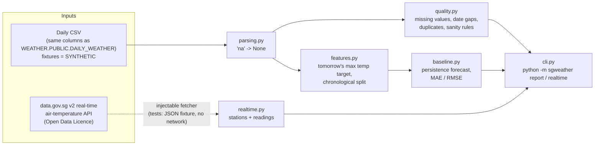
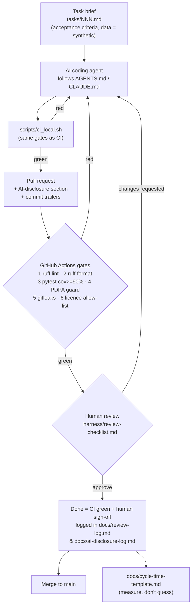

# Architecture

## 1. Code: data flow inside `sgweather`

## 2. Process: the agent harness around the code

## Design choices
- **Stdlib-only runtime.** This keeps the dependency and licence surface small, so the
  gates have little to check and SMEs can audit it quickly.
- **Injectable I/O.** The network sits behind a function argument, which keeps
  tests deterministic and lets CI run offline.
- **Generated synthetic fixtures.** Anyone can rerun `scripts/make_fixtures.py` to
  regenerate them, and their defects are deliberate and documented.
- **Gates are cheap and local-first.** If a gate cannot run on a laptop in seconds,
  people stop running it.
