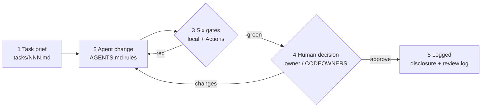

# How this repo was built with AI agents

This page walks through the actual build of this repository. Every step went
through the same loop: **task brief, then agent change, then gates, then human
decision**. The examples are real findings from this repo's history and are not
staged. The point is the process, which is the same process an SME team would run
on its own code.

## 1. Task brief: the human sets the target
Each change started as a brief with testable acceptance criteria, an explicit
"out of scope" list and a data rule (synthetic only):

| Brief | What it asked for |
|---|---|
| [001](../tasks/001-daily-quality-and-baseline.md) | Port the data-quality and target logic from a Snowflake weather course into a stdlib-only package |
| [002](../tasks/002-realtime-api-client.md) | A data.gov.sg client that never touches the network in tests |
| [003](../tasks/003-harness-and-ci-gates.md) | Agent rules, the six gates, and the evidence docs |
| [004](../tasks/004-models-beyond-baseline.md) | Simple models that must beat the persistence baseline, plus a CLI demo |

The "out of scope" lines did real work. For example, brief 004 ruled out heavy
ML dependencies, so the agent used `statistics.linear_regression` and did not
reach for scikit-learn.

## 2. Agent change: drafted by an AI coding agent
An AI coding agent (Grok Bot) wrote the code, tests and docs, following
[`AGENTS.md`](../AGENTS.md). Every commit carries the trailer
`AI-Assisted: yes (Grok Bot AI coding agent)`, and every change has a row in
[`ai-disclosure-log.md`](ai-disclosure-log.md).

## 3. Gates: what they actually caught
These came up during the build. Each one was fixed before the change could count as done:

| Gate | Real finding during this build | Fix |
|---|---|---|
| 1 ruff lint | `B905` `zip()` without `strict=` in the MAE/RMSE functions; a silent length mismatch would give wrong scores | `zip(..., strict=True)` plus an explicit length check |
| 1 ruff lint | `S311` pseudo-random generator in the fixture script | Kept on purpose (a seeded RNG for synthetic data, not crypto). The ignore is scoped to that one file with a comment |
| 1 ruff lint | `S106` "possible hard-coded password" on a dummy pagination token in a test | Reviewed: a false positive. The ignore is scoped to `tests/` only |
| 2 ruff format | The Python snippet *inside the README* was not formatted | Fixed the snippet. Ruff formats code blocks in docs too |
| 3 pytest | The agent's own expected value in the rolling-mean test was wrong | Recomputed by hand and corrected the test. The code was right; the test was wrong |
| 3 coverage | The new coverage badge rounded 99.75 % up to "100 %" | Changed to round down. A badge should never overstate |
| 5 gitleaks | Checked with a planted fake AWS key in a temporary folder | Detected (exit 1). The gate is known to fire |

Gates 4 (PDPA guard) and 6 (licence allow-list) had no findings in this build.
Both have tests or checks that prove they can fail.

The same gates run in GitHub Actions on every push and pull request
([workflow](../.github/workflows/ci.yml)), so passing on one laptop is not enough.

## 4. Human decision: accountable, and honest about scope
- The repo owner (Anthony Zee) **approved publication** on 2026-10-01. The commit
  trailers record exactly that: `Human-Review: approved for publication by Anthony Zee, 2026-10-01`.
- **This was not a line-by-line code review**, and the logs do not pretend it was.
  [`review-log.md`](review-log.md) entry R-001 says "checklist: not recorded".
  On client work, the Definition of Done requires the full checklist review.
- Dependency updates from Dependabot arrive as pull requests. They run the same
  gates and still wait for a human. A bot does not get to merge its own changes.

## 5. Evidence trail
- [`ai-disclosure-log.md`](ai-disclosure-log.md): which changes were AI-assisted, and who signed off
- [`review-log.md`](review-log.md): what the reviewer looked at and decided
- [`cycle-time-evidence.md`](cycle-time-evidence.md): real commit timestamps from this repo, with the limits stated
- `git log --format='%h %s%n %(trailers)'`: the same trail, straight from git

## What carries over to an SME codebase
The weather code is a stand-in. On a client repo the same harness files apply
unchanged: `AGENTS.md`, briefs, gates, review checklist and logs. What changes is the data rule.
Production and personal data stay out of agent context, and the client's DPO
decides what counts as safe test data.
